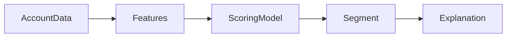

# AI Sales Intelligence Engine

Account propensity scoring service with domain features, deterministic scoring,
segments, and ranked feature explanations.

## Pipeline



## API

- `GET /health`
- `POST /score`

Example:

```json
{
  "account_id": "acct_001",
  "visits": 18,
  "spend": 42000,
  "account_age_days": 640,
  "usage_frequency": 88,
  "support_tickets": 1,
  "renewal_days": 30
}
```

## Run

```bash
pip install -r requirements.txt
python -m pytest -q
python evaluation/evaluate.py
uvicorn api.server:app --reload --port 8000
```

## Highlights

- CRM-style feature schema.
- Propensity score and low/medium/high segment.
- Ranked explanation contributions.
- Evaluation over labeled sample accounts.

## License

MIT
