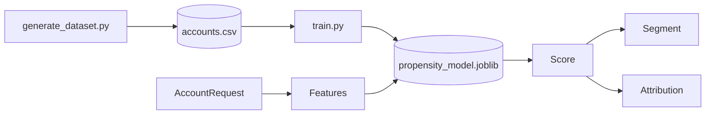

# AI Sales Intelligence Engine

Account propensity scoring service. A logistic regression **fitted** on a
synthetic account dataset produces a conversion probability, a segment, and a
per-feature attribution of its own output.

> **The served model is trained on synthetic data**, generated by
> `training/generate_dataset.py` (seeded and reproducible), not collected from a
> real CRM. Those metrics are real measurements on a held-out split, but they
> describe how well the model recovers a documented generating process.
>
> **The same pipeline is separately validated on real data** — 41,188 actual
> campaign outcomes from the UCI Bank Marketing dataset — in
> [`models/artifacts/real/model_card.md`](models/artifacts/real/model_card.md).
> That track is where the claim "this approach works" is tested against outcomes
> nobody designed. See [Validation on real data](#validation-on-real-data).

## Model

| | |
|---|---|
| Type | Logistic regression (`StandardScaler` → `LogisticRegression`) |
| Selection | `C` chosen by 5-fold CV on the training split only |
| Split | 75/25 stratified, `random_state=42`; test split scored once |
| Data | 5,000 synthetic accounts, 32.0% positive |

**Held-out test performance (n=1,250):**

| Metric | Value |
|---|---|
| ROC-AUC | **0.8614** |
| PR-AUC | 0.7580 |
| Accuracy | 0.7976 |
| Precision / Recall | 0.7262 / 0.5900 |
| Brier score | 0.1373 |

Cross-validated ROC-AUC on the training split is 0.8495 ± 0.0135, consistent with
the held-out figure — the model is not overfit.

For context on what those numbers can mean: the generator's **Bayes-optimal ROC-AUC
on this test split is 0.8898** — that is the score obtained by ranking on the true
conversion probability itself, and it is below 1.0 because labels are sampled from
that probability rather than thresholded. The model reaches 0.8614 against that
0.8898 ceiling, capturing roughly 97% of the ranking signal that exists in the data.
This is what gives the headline number scale: a ROC-AUC approaching 1.0 here would
indicate leakage or degenerate labels, not a better model. `training/train.py`
computes the ceiling on every run.

Segments are discriminative on held-out data:

| Segment | n | Actual conversion rate |
|---|---|---|
| `high_propensity` | 380 | 0.692 |
| `medium_propensity` | 367 | 0.283 |
| `low_propensity` | 503 | 0.066 |

Full details, fitted coefficients, and limitations: [`models/artifacts/model_card.md`](models/artifacts/model_card.md).

## Validation on real data

The synthetic track measures how well a model recovers a process we wrote. This
track runs the **same pipeline** against [UCI Bank Marketing](https://archive.ics.uci.edu/dataset/222/bank+marketing)
(CC BY 4.0) — 41,188 real contacts from a Portuguese bank's campaigns, May 2008 to
November 2010, labelled with whether the client actually subscribed.

```bash
python training/fetch_real_data.py
python training/train_real.py
```

The dataset is cached under `datasets/real/` and **not committed**; the fetcher
verifies a SHA-256 checksum so a changed upstream file fails loudly instead of
quietly moving the metrics.

**Held-out ROC-AUC 0.7090** (final 25% of the campaign, chronologically). Lower
than the synthetic figure, and the more meaningful of the two.

### Why it is lower, and why that is the point

Two evaluation choices decide this number, and both were made the harder way:

| Variant | ROC-AUC | Deployable? |
|---|---|---|
| **no `duration`, chronological split** | **0.7090** | **yes — the headline** |
| with `duration`, chronological split | 0.7931 | no — the feature doesn't exist at decision time |
| no `duration`, random split | 0.7987 | no — the split leaks the future |
| both together | 0.9364 | no — and this is the figure usually published |

`duration` is the length of the call being predicted: a call that ends in a
subscription is a long call, so the feature encodes the label and is unavailable
at the moment you decide whom to phone. Dropping it costs **0.0841**.

The rows are date-ordered across the financial crisis. A random split trains on
2010 to predict 2009; the train-period positive rate is 0.0642 against 0.2581 in
the test period, a fourfold drift a shuffle erases entirely. Splitting
chronologically costs **0.0897** — slightly *more* than the leaky feature does.

Together they inflate the headline by **0.2274**, from 0.7090 to 0.9364. All four
rows were measured here; none is quoted from a paper.

That comparison is the single most useful thing in this repository. It says that
how you evaluate can matter more than what you feed the model — demonstrated on
someone else's data, where the generating process was not ours to write.

This model is **not served**: its features are a bank campaign schema, not the six
account features in the `/score` payload. What transfers is the method.

## Pipeline



## API

- `GET /health` — status plus the identity of the loaded model
- `GET /metrics`
- `GET /events` protected when `API_KEY` is set
- `POST /score`

See `DEMO.md` for terminal demo steps, curl commands, and sample request/response files.

Example request:

```json
{
  "account_id": "acct_001",
  "visits": 18,
  "spend": 42000,
  "account_age_days": 640,
  "usage_frequency": 88,
  "support_tickets": 1,
  "renewal_days": 30
}
```

Set `API_KEY` to require `X-API-Key` on scoring/event endpoints.
Set `APP_DB_PATH` to control the SQLite event database location.

### Distributed tracing

Every event is stored with the request id that produced it, and `/v1/events`
accepts a `request_id` filter. That is what makes a cross-service trace joinable:
the id already crossed service boundaries, but until it was recorded next to the
event there was nothing to join on.

```bash
curl "localhost:8000/v1/events?request_id=demo-1a2b3c4d"
```

The portfolio repo's `scripts/trace.py` asks all five services this question and
merges the answers into one ordered timeline.

## API versioning

Data endpoints are served under **`/v1`**. The same endpoints remain available at
the unversioned path as a **deprecated alias**, so consumers written before
versioning keep working; new callers should use `/v1`.

```bash
curl localhost:8000/version
```

`/health`, `/metrics` and `/version` are deliberately **not** versioned. They
describe the process rather than the API, and a monitoring system should not have
to follow an API version bump to keep scraping.

Both paths are served by one set of handlers, so the alias cannot drift from the
versioned route. `tests/test_api_versioning.py` asserts every data endpoint is
reachable under `/v1`, that the alias still exists, and that infrastructure
endpoints stay unversioned.

Why it matters here: without a version prefix there is no way for this service to
change a response shape without breaking every consumer on the same deploy. The
consumer-driven contract checks in the portfolio repo *detect* that breakage —
they do not prevent it.

## Run

```bash
pip install -r requirements.txt
python -m pytest -q
python evaluation/evaluate.py
uvicorn api.server:app --reload --port 8000
```

The trained artifact is committed, so the service runs on a fresh clone without
a training step. To regenerate everything from scratch:

```bash
python training/generate_dataset.py
python training/train.py
```

To confirm the committed data and model are reproducible rather than taking them
on trust — this is what CI runs:

```bash
python training/generate_dataset.py --check
python training/train.py --verify
```

With the server running, use a second terminal for the smoke check:

```bash
python scripts/smoke_test.py
```

Docker:

```bash
cp .env.example .env
docker compose up --build
```

Kubernetes manifests live in `k8s/deployment.yaml` and include probes, resource
limits, a Service, and a PVC for the SQLite event store. The default manifest
uses one replica because SQLite is the default event store.

## Cross-service integration (optional)

This service exposes an account lookup so callers that know only an account id can
ask for propensity without carrying feature vectors around:

```
GET /accounts/{account_id}/score
```

The features stay owned by the service that models them — the feature-store role
in miniature, backed here by the generated dataset. The customer operations
service uses it to escalate high-propensity accounts that write in unhappy.

This is a read-only addition. Nothing about the model, the metrics, or the
existing `/score` contract changes.

## Reviewer Status

**What is real and independently checkable:**

- A fitted logistic regression. Coefficients are learned, not hand-chosen —
  readable in [`models/artifacts/coefficients.json`](models/artifacts/coefficients.json).
- Hyperparameter selection cross-validated on the training split only; the test
  split is scored exactly once.
- Metrics measured on held-out data, recomputed from the artifact by
  `tests/test_model_quality.py` rather than trusted from a file.
- Explanations are an exact decomposition of the model's own log-odds
  (`coefficient × standardised value`), asserted by a test that reconstructs the
  logit — not an indicative importance table.
- Segment thresholds derived from the training-set score distribution, not
  round numbers.
- Dataset and training run reproducible, verified in CI on every push.
- The same pipeline validated on **real** outcomes (UCI Bank Marketing, CC BY 4.0),
  with the leakage and split choices measured rather than asserted.

**What is explicitly not real:**

- **The served model's data is synthetic.** No real CRM feed, no real conversion
  outcomes. The pipeline is validated separately on real campaign data
  ([above](#validation-on-real-data)), but that model is not the one behind
  `/score`, and no claim here is that it is.
- **`industry` is a signal the model cannot see.** It shifts conversion from
  0.234 to 0.416 across sectors in the generator and is part of
  `datasets/production_schema.json`, but it is not in the `/score` payload, so
  the model is not trained on it. This is a deliberate, documented gap.
- No calibration layer beyond logistic regression's native output.
- No drift detection, retraining trigger, or live score monitoring.
- The SQLite event store is an audit trail for demos, not a production system.
- Docker/Compose/Kubernetes config is validated by static inspection and CI image
  builds; **cloud deployment is pending and unverified**.

**Quickstart:** run tests and eval, start `uvicorn api.server:app --reload --port 8000`,
then run `python scripts/smoke_test.py`.

**Shared scaffolding:** this service's HTTP hardening (`utils/security.py`), event
store (`utils/storage.py`), and metrics surface follow a common service template
shared with the other Python services in this portfolio. That is deliberate reuse,
not independent implementations.

**Portfolio index:** https://github.com/Adityansh-Chand/ai-engineering-portfolio

## Highlights

- Fitted propensity model with measured held-out metrics, not a hand-tuned formula.
- Reproducible seeded data generator with a documented non-linear ground truth
  the fitted model cannot trivially recover.
- Exact per-feature attribution that provably reconstructs the model's logit.
- Quantile-derived segment thresholds with verified discrimination.
- Quality gate in CI that fails on model regression — and on implausibly good scores.
- SQLite event audit trail for score results.
- Production data contract in `datasets/production_schema.json`.

## License

MIT
