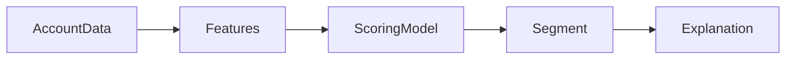

# AI Sales Intelligence Engine

Account propensity scoring service with domain features, deterministic scoring,
segments, and ranked feature explanations.

## Pipeline



## API

- `GET /health`
- `GET /metrics`
- `GET /events` protected when `API_KEY` is set
- `POST /score`

Example:

```json
{
  "account_id": "acct_001",
  "visits": 18,
  "spend": 42000,
  "account_age_days": 640,
  "usage_frequency": 88,
  "support_tickets": 1,
  "renewal_days": 30
}
```

Set `API_KEY` to require `X-API-Key` on scoring/event endpoints.
Set `APP_DB_PATH` to control the SQLite event database location.

## Run

```bash
pip install -r requirements.txt
python -m pytest -q
python evaluation/evaluate.py
uvicorn api.server:app --reload --port 8000
```

With the server running, use a second terminal for the smoke check:

```bash
python scripts/smoke_test.py
```

Docker:

```bash
cp .env.example .env
docker compose up --build
```

Kubernetes manifests live in `k8s/deployment.yaml` and include probes, resource
limits, a Service, and a PVC for the SQLite event store. The default manifest
uses one replica because SQLite is the default event store.

## Highlights

- CRM-style feature schema.
- Propensity score and low/medium/high segment.
- Ranked explanation contributions.
- Evaluation over labeled sample accounts.
- SQLite event audit trail for score results.
- GitHub Actions CI for tests, eval, and container build.
- Production data contract in `datasets/production_schema.json`.

## License

MIT
